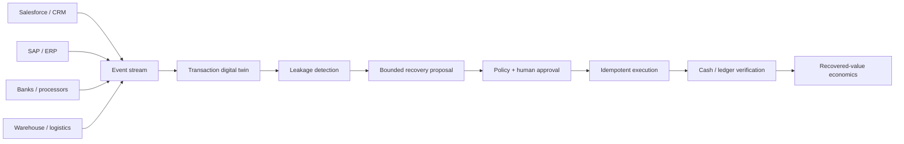

# Autonomous Order-to-Cash Revenue Assurance

**Agentic AI order-to-cash automation across SAP S/4HANA, Salesforce, payments, logistics, accounts receivable, reconciliation and Azure—measured in verified recovered value.**

[](https://github.com/AAH20/autonomous-order-to-cash-revenue-assurance/actions/workflows/ci.yml) [](pyproject.toml) [](LICENSE)

Enterprise revenue leaks between order acceptance and cash in the ledger. This project creates a transaction twin, detects broken lifecycle transitions, assigns bounded recovery actions and counts recovery only when supplied verification evidence confirms it.

> The local engine and tests are implemented. The 10,000-order case is synthetic. SAP, Salesforce and Azure integrations are contracts until exercised with authorization.

The [read-only reconciliation pilot](docs/RECONCILIATION_PILOT.md) adds a separate `o2c-reconcile` command for normalized invoice and payment CSV exports. It produces a finance review queue with conservative matching and explicit limitations. It has no live accounting connector or write-back path, and its example exports are fictional.

## Reproduce

```bash
python3 examples/generate_case.py
PYTHONPATH=src python3 -m unittest discover -s tests -v
PYTHONPATH=src python3 -m revenue_assurance.cli examples/synthetic-10000-orders.json --output evidence/synthetic-analysis.json
```

## Synthetic case

| KPI | Result |
|---|---:|
| Orders | 10,000 |
| Findings | 800 |
| Approval-required actions | 600 |
| Exposed value | $1,650,150 |
| Verified recovered value | $762,400 |
| Modeled platform cost | $18,500 |
| Net recovered value | $743,900 |
| Cost per recovered dollar | $0.0243 |

These are deterministic fixture results—not customer revenue, realized savings or a financial projection.

## Detects

- Shipped but not invoiced
- Unapplied cash
- Pricing mismatches
- Duplicate invoices
- Duplicate payments
- Ledger reconciliation gaps
- Aged disputes
- Stale credit holds

## Architecture



## Evidence and safety

- Every action has a deterministic idempotency key.
- Material credits, refunds, invoices, pricing and ledger actions require approval.
- Recovery cannot exceed the exposed value of its finding.
- No recovery is claimed without supplied verification evidence.
- Agents cannot alter accounting tolerances or write directly to the ledger.

## KPIs

Revenue leakage, unbilled shipment value, unapplied cash, dispute aging, DSO, invoice accuracy, cash-match rate, perfect-order rate, recovery rate, erroneous-action rate, cost per recovered dollar and time to resolution.

## Search alignment

Order to cash, order-to-cash automation, accounts receivable automation, SAP order to cash, SAP S/4HANA, Salesforce integration, revenue leakage, payment reconciliation, cash application, invoice automation, dispute management, working capital optimization, Azure AI, agentic AI finance, autonomous finance, Microsoft Fabric and Power BI.

## Engage

[Request an order-to-cash revenue assurance assessment](https://a2zsoc.com/contact?topic=order-to-cash-revenue-assurance&utm_source=github&utm_medium=repository).
