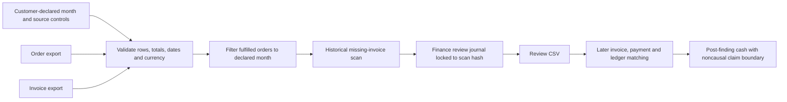
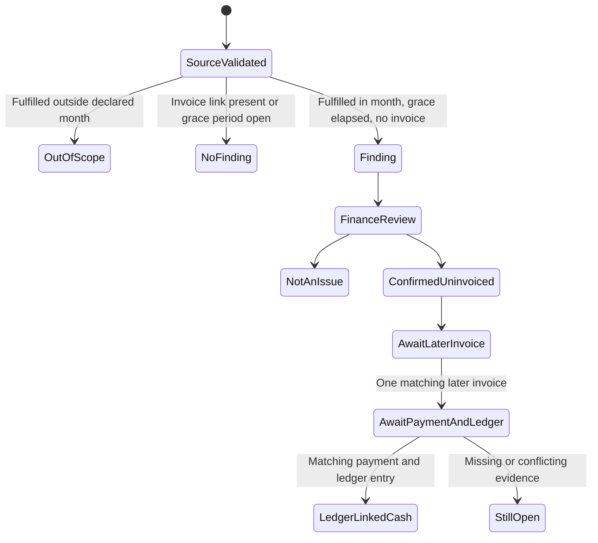

# Fulfillment-to-Cash: first sellable pilot workflow

The first commercial wedge is a finance team with a closed month of **fulfilled B2B orders and issued invoices**. The local OSS path detects orders without matching invoices after a declared grace period, gives finance a review queue, and later checks whether a newly issued invoice has a payment and ledger entry. This release adds exact month scoping and a write-once application-level review journal. It does not connect to an ERP, authenticate reviewers, create invoices, collect money, or prove the service caused a payment.



## Reproduce the fictional month

```bash
python -m pip install -e .
o2c-pilot run examples/recovery/pilot-manifest.json --output-dir /tmp/o2c-ftc-demo
o2c-review /tmp/o2c-ftc-demo init
o2c-review /tmp/o2c-ftc-demo review F-9f0705e905eda11134e5 \
  --decision confirmed_uninvoiced --reviewer 'Fictional finance reviewer' --minutes 12
o2c-review /tmp/o2c-ftc-demo metrics --hourly-rate-usd 60.00
o2c-review /tmp/o2c-ftc-demo export --output /tmp/o2c-ftc-demo/reviews-journal.csv
o2c-pilot followup /tmp/o2c-ftc-demo/scan.json /tmp/o2c-ftc-demo/reviews-journal.csv \
  examples/recovery/invoices-followup.csv examples/recovery/payments-followup.csv \
  examples/recovery/ledger-followup.csv --output /tmp/o2c-ftc-followup.json
```

The run has one in-month finding. A separate fulfilled order dated in September is excluded from the August scan even when it is older than the grace period. The fictional review records 12 minutes. At an **assumed** $60/hour, modeled review labor is $12 for the one reviewer-confirmed finding. That figure excludes onboarding, export preparation, infrastructure, finance follow-up, sales and support; it is not a service margin.

The committed follow-up invoice for the finding is dated September 12, while a journal review performed now is later. The follow-up report therefore shows **no confirmed cash after that review**. The older, prefilled `examples/recovery/reviews.csv` records a fictional September 11 review and can demonstrate the positive arithmetic path, but it is not a newly authenticated decision. The chronological rule is deliberate: a payment that predates the recorded review cannot be attributed to review work.

## Transaction and claim model



The scan hash locks the local journal to a specific `scan.json`; a changed scan prevents the desk from reopening. Each finding can receive one decision through the CLI. Direct database edits remain possible for a local operator, so this is **application-level write-once behavior**, not authenticated or tamper-evident audit. The export is compatible with the existing `o2c-pilot followup` command. Customer identity, source-system completeness, reviewer authority and invoice authenticity are not independently established.

## Precise pilot economics

| Measure | Formula | Claim limit |
| --- | --- | --- |
| Possible exposure | Sum of in-month finding order totals | May be legitimately unbilled; not a receivable or cash |
| Review coverage | Reviewed findings / all findings | Reviewer identity is self-declared |
| Review labor | Recorded minutes × assumed hourly rate / 60 | Modeled, not payroll-verified |
| Review cost per confirmed finding | Modeled review labor / reviewer-confirmed findings | Excludes other delivery costs |
| Ledger-linked cash after finding | Exact matching later invoice → payment → ledger | Timing and linkage, not causal recovery |
| Commercial contribution margin | Collected service fees − connector, review, support, infrastructure, acquisition and rework costs | Not computable from the fictional fixture |

For a paid pilot, measure false findings with finance review, sample non-findings to estimate missed issues, and record onboarding and follow-up hours. Report currencies separately. Set a fee basis only through a customer agreement and an attribution method that accounts for collections that would have occurred without this service.

## Release gates

1. Obtain one customer's written authorization for a specific accounting month, export scope, retention period and finance reviewers. Run inside customer-controlled storage.
2. Reconcile source export controls against the ERP's own row counts and totals. Confirm how partial fulfillment, consolidated invoices, credits and multi-currency records should be handled before expanding the normalized contract.
3. Have finance review every finding and sample matched/non-finding orders. Measure precision, missed issues, review minutes and time to resolution.
4. Build one authorized read-only ERP connector after the export semantics are validated. Add checkpointing, pagination, retries and source-run IDs; keep finance write actions out of the connector.
5. Add authenticated reviewers, append-only audit storage, tenant isolation and recovery procedures before hosted or multi-customer use.

The OSS layer retains normalized data contracts, month-scoped matching, review-state logic, fixtures and tests. A commercial service can maintain authorized connectors, onboarding, secure hosted workspaces, finance operations and support. A success fee requires an agreed causal attribution and collection definition; it is not justified by a matching ledger record alone.
