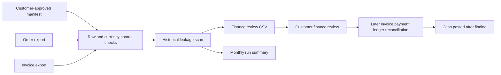

# Revenue Recovery Cloud: first customer pilot slice

This release adds an executable **local, read-only** pilot workflow to the existing recovery engine. It is intended for one customer-controlled workspace and one accounting period at a time. It does not connect to an ERP, authenticate a reviewer, host customer data, invoice anyone, or contact debtors. The included merchant and every amount are fictional.

The current pilot additionally enforces the declared order month and supports the local [Fulfillment-to-Cash review desk](FULFILLMENT_TO_CASH.md) as a structured alternative to editing the review CSV by hand.



## Run the fictional example

```bash
python -m pip install -e .
o2c-pilot run examples/recovery/pilot-manifest.json --output-dir /tmp/o2c-pilot-demo
o2c-pilot followup /tmp/o2c-pilot-demo/scan.json examples/recovery/reviews.csv \
  examples/recovery/invoices-followup.csv examples/recovery/payments-followup.csv \
  examples/recovery/ledger-followup.csv --output /tmp/o2c-pilot-followup.json
```

`run` emits `scan.json`, `summary.json` and `review-queue.csv`. The queue is a template. Finance fills `reviewer`, `decision` and `reviewed_at`, then supplies the resulting CSV to `followup`; the example command uses the prefilled fictional `reviews.csv`. The finding count is one, possible exposure is USD 100.00, and the later fictional ledger-linked cash is USD 100.00. These are distinct measures. The latter **does not establish causal recovery**.

The manifest's `customer_key` is a pseudonym, `period` is `YYYY-MM`, and source paths resolve relative to the manifest. Customer-declared row counts and totals by currency must match parsed exports exactly. This detects some incomplete or changed exports but cannot prove that the source system returned every relevant record. Each report includes SHA-256 hashes of its input files; hashes identify versions, not source authenticity. Runs and follow-up reports refuse to overwrite an existing destination.

For a real pilot, obtain written permission and a defined data scope. Keep exports and generated files in the customer's controlled storage; do not commit them. The repository ignores `customer-data/` and `pilot-runs/`, but operators must set local access permissions, retention, encryption, and backups suitable for their environment. Verify that their source controls represent the exact export scope and cutoff. Have finance review the queue and a sample of non-findings, then record reviewer time and false positives outside the engine. Do not treat a later ledger posting as an attribution or billing basis without an agreed method.

## Next production gates

1. Run with one consenting customer and validate source mappings, export coverage, control totals and reviewer access in their environment.
2. Replace CSV review identity with authenticated customer finance users and immutable decisions; add role-scoped access, tenant isolation, encryption and retention before hosting data.
3. Build one authorized read-only connector only after its export semantics and permissions are documented. Add operational retries, monitoring and incident handling.
4. Measure onboarding hours, finding precision, missed issues, review minutes, recurring run cost, and confirmed cash separately. Publish customer claims only with permission and an agreed attribution method.

The OSS boundary is the normalized input contract, deterministic engine, manifest validator, local runner, fictional fixtures and tests. A commercial service may offer managed connectors, hosting, tenant operations, support and review workflow, but those capabilities are **not implemented here**.
