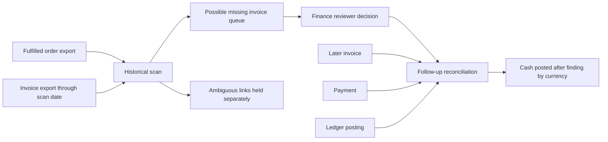

# Revenue Recovery Operator: export-first pilot

`o2c-recovery` adds a deliberately narrow, read-only path for **fulfilled orders with no matching invoice**. It has two commands: `scan` creates a finance review queue from normalized order and invoice exports; `confirm` checks a later reviewer decision, invoice, payment and ledger export for cash posted **after** the finding. All included files are fictional. The tool never creates an invoice, contacts a debtor, changes a ledger, or proves that its finding caused a payment.



## Reproduce the fictional workflow

```bash
python -m pip install -e .
o2c-recovery scan examples/recovery/orders.csv examples/recovery/invoices-scan.csv \
  --as-of 2026-09-10 --invoice-export-through 2026-09-10 \
  --grace-days 7 --output /tmp/o2c-scan.json
o2c-recovery confirm /tmp/o2c-scan.json examples/recovery/reviews.csv \
  examples/recovery/invoices-followup.csv examples/recovery/payments-followup.csv \
  examples/recovery/ledger-followup.csv --output /tmp/o2c-confirmation.json
```

The scan finds fictional order `O100` as a possible `$100.00` unbilled order and holds `O400` because its invoice amount differs. The follow-up shows `$100.00` in a fictional payment and ledger entry after a fictional reviewer confirmed `O100` was uninvoiced. This is **not customer revenue, a realized saving, or causal recovery**. A source-system correction, later payment, or unrelated collection work could explain the same sequence.

## Exact CSV contracts

| Input | Required columns |
|---|---|
| Orders | `order_id,customer_id,currency,total,fulfilled_at,status` |
| Scan and follow-up invoices | `invoice_id,order_id,customer_id,currency,total,issued_at` |
| Reviews | `finding_id,reviewer,decision,reviewed_at` |
| Follow-up payments | `payment_id,invoice_id,customer_id,currency,amount,received_at` |
| Follow-up ledger | `entry_id,payment_id,currency,amount,posted_at` |

Dates are ISO dates. Monetary values have at most two decimal places. IDs must be unique within each file. `status` is `fulfilled`, `pending`, or `cancelled`. Review decisions are `confirmed_uninvoiced` or `not_an_issue`. The invoice export cutoff is an **operator declaration** that the export covers the scan date; the tool cannot verify API permissions or source completeness. Invoices issued after the historical scan date do not erase a historical finding. The grace period is configurable from 0 to 90 days.

A finding is generated only for a positive-value fulfilled order older than the grace period with **no invoice linked by order ID** as of the scan date. Any linked invoice count other than one, or a customer/currency/total mismatch, goes to a separate manual hold. The current contract assumes one invoice per order; partial invoicing, credit notes, reversals, tax/discount differences, returns, multi-currency conversion and split fulfillment are **not reconciled** by this release. Pre-normalize or hold them for finance review. Never infer a missing invoice from matching dollar amounts alone.

The confirmation path requires one reviewer-declared `confirmed_uninvoiced` decision, one later matching invoice, a payment linked to it, and one same-currency/same-amount ledger entry linked to that payment with valid date order. Multiple invoices, duplicate IDs, absent entries, and overpayments do not create a confirmed-cash total. Totals stay separate by currency. Reviewer identity and all exports are **unauthenticated operator-supplied data**; file digests identify input versions but do not attest origin.

## First authorized customer pilot

1. Obtain permission for one closed month of order and invoice exports, plus an agreed source-system mapping, row counts and control totals. Keep all real files in customer-controlled storage.
2. Run `scan` read-only and have finance label every finding and a sample of non-findings. Measure precision, missed issues, review minutes and duplicates against their current close process. Do not send invoices from the tool.
3. Let finance perform any approved correction in its normal ERP/accounting workflow. Collect later invoice, payment and ledger records, then run `confirm`. Confirm bank settlement separately if the commercial agreement requires collected cash rather than a ledger posting.
4. Compare all-in analyst/platform cost with cash confirmed after findings and document competing causes of payment. A recovery fee, if any, needs a customer-approved attribution and contract definition; this software does not calculate one.

## OSS and commercial boundary

Keep the normalized contracts, deterministic scan/confirmation logic, synthetic fixtures and tests open. A commercial layer could offer authorized Shopify/Stripe/QuickBooks or ERP connectors, data mapping, authenticated finance review, exception operations, customer-specific controls, monitoring and support. Those integrations are future work, not present in this release. [Shopify order webhooks](https://shopify.dev/docs/apps/build/webhooks), [Stripe balance transactions](https://docs.stripe.com/api/balance_transactions/object) and [QuickBooks invoices](https://developer.intuit.com/app/developer/qbo/docs/api/accounting/most-commonly-used/invoice) are possible source interfaces; their exact semantics must be mapped and tested with each customer.
